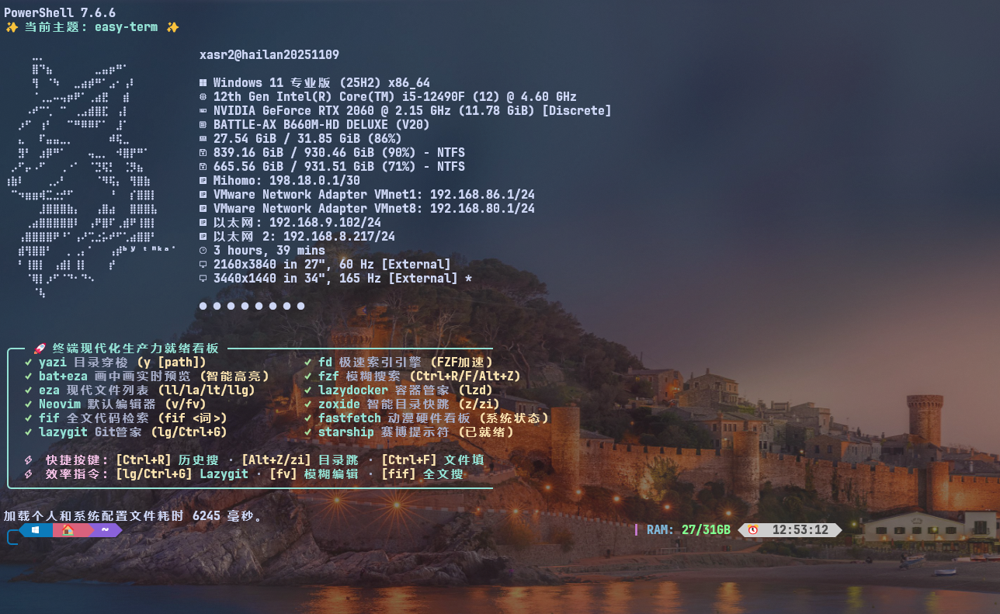

# Windows 全终端现代化与美化套件

Windows Terminal & Multi-Shell Modernization · Windows ターミナル美化

[简体中文](#简体中文) · [English](#english) · [日本語](#日本語) · [项目截图](#项目展示截图) · [文档索引](#文档索引)

为 PowerShell 7、Windows PowerShell 5.1、CMD、NuShell 和 MSYS2 配置提示符、字体、工具别名与启动横幅，提供安装前配置快照和恢复入口。

## 项目展示截图



截图展示本机 PowerShell 7 的实际效果，包括 Oh My Posh 主题、Fastfetch 字符画、硬件信息及中文快捷命令提示。背景壁纸是本机个性化设置，未作为壁纸文件随项目提供；截图中的版本、硬件、工具状态和启动耗时仅代表拍摄时的环境。[查看原图](assets/Ashampoo_Snap_12h54m57s.png)。

## 简体中文

### 功能与适用范围

- PowerShell 7 / Windows PowerShell 5.1 共用 Profile，支持每次交互启动随机选择本地 Oh My Posh 主题、固定主题和 Starship。
- CMD 通过 Clink 加载 Starship，NuShell 和 MSYS2 使用各自生成的配置。
- `fonts/` 内含 48 个 JetBrainsMono Nerd Font TTF 文件，可独立离线安装；工具、模块与主题准备仍可能需要网络。
- Fastfetch 使用项目内的字符画和配置；PowerShell 提供 `y`、`fv`、`fif`、`lg` 等命令。
- 按组件保存配置快照，恢复前验证哈希并保存当前内容；已有文件采用单文件原子替换。

主要使用环境为 Windows 10/11。脚本兼顾 Windows PowerShell 5.1 语法，但不意味着最新版 PowerShell、Windows Terminal 或所有依赖均支持 Windows 8.1。上游支持取决于具体系统和软件版本，见 [PowerShell 官方安装说明](https://learn.microsoft.com/en-us/powershell/scripting/install/install-powershell-on-windows)。

### 快速安装

在 PowerShell 中克隆仓库并进入目录。没有 Git 时也可下载并解压仓库，之后进入解压目录执行脚本。

```powershell
git clone https://github.com/vicky-clair/configuration_of_Terminal_and_PowerShell_for_Xia_Rui.git
cd configuration_of_Terminal_and_PowerShell_for_Xia_Rui

# 全新机器可从系统自带的 Windows PowerShell 启动安装，无需预先安装 pwsh。
# 默认配置 PowerShell 7、Windows PowerShell 5.1、CMD 及其共享依赖。
powershell.exe -NoProfile -ExecutionPolicy Bypass -File .\Install-All.ps1

# 可选：同时安装、配置 NuShell 与 MSYS2。
# powershell.exe -NoProfile -ExecutionPolicy Bypass -File .\Install-All.ps1 -All
```

已有 PowerShell 7 时，可将示例中的 `powershell.exe` 换成 `pwsh`。通常从当前用户会话运行；具体软件安装、WinGet 源修复或系统字体安装可能要求管理员权限。`-ExecutionPolicy Bypass` 只指定启动进程的策略；安装器自身也可能修改当前用户执行策略，详见[部署与回退](部署与回退.md)。

Windows Terminal 需单独安装。PS7 安装步骤会询问是否应用完整 Terminal 设置模板，这会覆盖目标设置。安装器的 `-NonInteractive` 跳过其自身的选择提示；未显式指定 `-ApplyWindowsTerminalSettings` 时不应用完整模板，也不保证外部包管理器完全无交互。

### 独立安装与主题选择

| 组件 | 示例（在仓库根目录执行） |
| --- | --- |
| PowerShell 7，随机主题 | `pwsh -NoProfile -File .\Install-PowerShell7.ps1 -ThemeMode Random` |
| PowerShell 7，固定主题 | `pwsh -NoProfile -File .\Install-PowerShell7.ps1 -ThemeMode Fixed` |
| Windows PowerShell 5.1，默认随机主题 | `powershell.exe -NoProfile -File .\Install-WinPowerShell51.ps1` |
| Windows PowerShell 5.1，Starship | `powershell.exe -NoProfile -File .\Install-WinPowerShell51.ps1 -Theme Starship` |
| CMD | `pwsh -NoProfile -File .\Install-Cmd.ps1` |
| NuShell | `pwsh -NoProfile -File .\Install-NuShell.ps1` |
| MSYS2，自定义目录 | `pwsh -NoProfile -File .\Install-MSYS2.ps1 -Msys2InstallPath 'D:\Tools\msys64'` |
| 当前用户离线字体 | `powershell.exe -NoProfile -File .\Install-Fonts.ps1` |

总装的 `-ThemeMode Random/Fixed/Starship` 只传给 PowerShell 7；Windows PowerShell 5.1 仍使用其默认 `Random`。总装也支持 `-SkipPowerShell7`、`-SkipWinPowerShell51`、`-SkipCmd`、`-IncludeNuShell` 和 `-IncludeMSYS2`。

### 验证、部署与恢复

```powershell
# 检查仓库语法、配置和 Profile 约束。
pwsh -NoProfile -File .\tests\Verify-Configuration.ps1

# 撤销最近一次安装：先预演，再根据输出执行。
pwsh -NoProfile -File .\Restore-All.ps1 -WhatIf
# pwsh -NoProfile -File .\Restore-All.ps1

# 已安装依赖后，同步仓库配置的独立部署入口。
pwsh -NoProfile -File .\Deploy-TerminalConfiguration.ps1 -WhatIf
# pwsh -NoProfile -File .\Deploy-TerminalConfiguration.ps1

# 撤销该部署（包含 CMD），使用独立的部署快照指针。
pwsh -NoProfile -File .\Restore-TerminalConfiguration.ps1 -IncludeCmd -WhatIf
```

恢复只处理所选快照包含的受管配置，不卸载软件、模块或字体，不撤销所有安装副作用，也不是多文件与注册表的整体事务。部署入口还会配置 Fastfetch，但当前部署快照未包含 `Shared` 组件；执行前应另存共享配置。完整范围、旧快照兼容与失败处理见[部署与回退](部署与回退.md)。

### 常用命令（PowerShell Profile）

| 命令 / 快捷键 | 用途与依赖 |
| --- | --- |
| `ll` / `la` / `lt` / `llg` | 目录列表、隐藏文件、目录树、Git 状态；优先使用 eza |
| `catc README.md` | bat 高亮预览；`cat` 保留 PowerShell 自身含义 |
| `z <关键词>` / `zi` / `Alt+Z` | zoxide 目录跳转；交互选择需要 fzf |
| `Ctrl+F` / `Ctrl+R` | PSFzf 文件选择 / 历史检索，需要 PSReadLine、PSFzf、fzf |
| `fv` / `fif <关键词>` | 模糊选文件编辑 / ripgrep 全文检索，依赖 fzf 等工具 |
| `y` | Yazi 文件管理，退出后同步所在目录 |
| `lg` / `Ctrl+G` | Lazygit；快捷键需要 PSReadLine 与 lazygit |
| `Enable-Vfox` | 按需启用 vfox；默认不在启动时激活 |
| `Test-Environment` / `Update-Profile` | 检查工具和模块 / 重新加载 Profile |

别名和快捷键按 Shell 生成，不能假定所有 Shell 都完全一致。开关默认值与设置方法见[美化与使用说明](windows终端美化相关.md)。

## English

This project configures PowerShell 7, Windows PowerShell 5.1, CMD, NuShell and MSYS2 with prompts, Nerd Fonts, aliases and Fastfetch. The screenshot above shows a customized local setup; the wallpaper and measured startup time are specific to that machine.

From the repository directory, run `powershell.exe -NoProfile -ExecutionPolicy Bypass -File .\Install-All.ps1`. Add `-All` to include NuShell and MSYS2. Both PowerShell installers default to random local Oh My Posh themes; `Install-All.ps1 -ThemeMode` controls PowerShell 7 only. Dependencies may require network access or elevation. Windows Terminal must be installed separately.

Preview installation rollback with `pwsh -NoProfile -File .\Restore-All.ps1 -WhatIf`. Configuration deployment uses a separate pointer and `Restore-TerminalConfiguration.ps1 -IncludeCmd`. Recovery covers the selected snapshot's managed configuration, not installed applications, fonts or every installation side effect. Detailed Chinese guides below document these boundaries and verification commands.

## 日本語

PowerShell 7、Windows PowerShell 5.1、CMD、NuShell、MSYS2 のプロンプト、フォント、エイリアス、Fastfetch を設定するプロジェクトです。上のスクリーンショットは個人環境の例で、壁紙や起動時間は共通の既定値ではありません。

リポジトリのディレクトリで `powershell.exe -NoProfile -ExecutionPolicy Bypass -File .\Install-All.ps1` を実行します。NuShell と MSYS2 を含めるには `-All` を追加します。両 PowerShell の既定テーマはローカルからのランダム選択です。総合インストーラーの `-ThemeMode` は PowerShell 7 のみに適用されます。依存ソフトの取得にはネット接続や管理者権限が必要な場合があります。

復元の事前確認は `pwsh -NoProfile -File .\Restore-All.ps1 -WhatIf`。構成のデプロイには別の復元入口 `Restore-TerminalConfiguration.ps1 -IncludeCmd` を使用します。復元対象はスナップショットに含まれる設定で、アプリやフォントのアンインストールは行いません。

## 项目结构

```text
├── Install-All.ps1                  # 按组件调用安装器
├── Install-*.ps1                    # Shell / 字体独立安装
├── Deploy-TerminalConfiguration.ps1 # 已有环境的配置同步
├── Restore-All.ps1                  # 安装快照恢复
├── Restore-TerminalConfiguration.ps1# 部署快照恢复
├── Manage-TerminalConfiguration.ps1 # 旧 deployment.json 快照管理
├── Microsoft.PowerShell_profile.ps1 # PS7 / PS5.1 共用 Profile 源码
├── settings.json                    # Windows Terminal 设置模板
├── assets/                          # README 展示截图
├── fonts/                           # 48 个 TTF 字体文件
├── fastfetch/                       # 字符画与系统信息配置
├── starship/                        # Starship 提示符配置
├── cmd/                             # CMD AutoRun 安装与 Clink 模板
├── scripts/                         # 安装、状态、快照与模块公共逻辑
├── tests/                           # 语法、隔离回归与启动测量脚本
└── backups/                         # 历史资料与本机运行产生的备份
```

## 文档索引

| 文档 | 内容 |
| --- | --- |
| [部署与回退](部署与回退.md) | 安装与部署区别、快照指针、恢复范围、失败处理 |
| [开发与部署文档](开发与部署文档.md) | 架构、参数、中文注释规范、验证与维护 |
| [终端美化与使用](windows终端美化相关.md) | 字体、主题、壁纸、快捷键、开关与排障 |
| [IDE 与开发工具集成](IDE与开发工具集成指南.md) | VS Code、Cursor、JetBrains 终端配置 |
| [安全稳定性性能审计（历史）](安全稳定性性能审计-2026-09-07.md) | 2026-09-07 审计基线与发现 |
| [审计修复复核（历史）](审计修复复核-2026-09-07.md) | 当时的修复、复核与测量证据 |
| [备份目录说明](backups/README.md) | 历史资料、快照格式与使用限制 |

## 许可

项目代码许可见 [LICENSE](LICENSE)。第三方字体和工具的使用、分发还应遵循各自许可。
