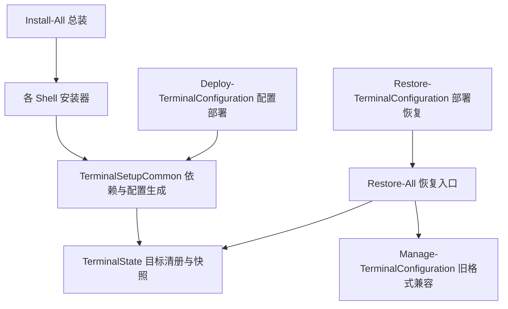

# 开发与维护指南

本文以当前仓库源码为依据，说明模块职责、参数、中文注释和验证方法。安装操作见[部署与回退](部署与回退.md)，用户设置见[终端美化与使用](windows终端美化相关.md)。2026-09-07 的审计数据属于历史证据，不是当前版本的性能承诺。

## 架构与入口



| 文件 / 目录 | 职责 |
| --- | --- |
| [Install-All.ps1](Install-All.ps1) | 收集组件、建立父快照、按序调用安装器；MSYS2 解析实际根目录后补入父快照 |
| [scripts/TerminalSetupCommon.ps1](scripts/TerminalSetupCommon.ps1) | 包管理器、模块安装、主题同步、Terminal 入口注册、共享配置生成 |
| [scripts/TerminalState.ps1](scripts/TerminalState.ps1) | 目标白名单、哈希、原子文件替换、注册表类型、快照预检与救援恢复 |
| [Microsoft.PowerShell_profile.ps1](Microsoft.PowerShell_profile.ps1) | PS7 / PS5.1 共用交互功能、受管初始化、主题与快捷键 |
| [cmd/Install-CmdConfiguration.ps1](cmd/Install-CmdConfiguration.ps1) | CMD 配置部署、可信程序路径解析、Starship Lua 生成与 AutoRun 设置 |
| [scripts/Install-RequiredModules.ps1](scripts/Install-RequiredModules.ps1) | 在目标 PowerShell 引擎的子进程中安装固定版本模块 |
| [scripts/New-DeploymentSnapshot.ps1](scripts/New-DeploymentSnapshot.ps1) | 旧式双文件 before/after 快照；要求当前 PS7 和 Terminal 配置存在，并更新部署指针 |
| [scripts/Backup-SystemConfigurations.ps1](scripts/Backup-SystemConfigurations.ps1) | 历史系统审计采集，含工具信息和部分历史数据；不是通用恢复入口 |
| `tests/` | 独立进程运行的静态与隔离回归测试、可选注册表测试和性能测量 |

## 参数与默认行为

| 入口 | 主要参数 | 默认行为 / 注意事项 |
| --- | --- | --- |
| `Install-All.ps1` | `-ThemeMode Random/Fixed/Starship`、`-All`、`-IncludeNuShell`、`-IncludeMSYS2` | 默认 PS7、PS5.1、CMD；ThemeMode 只传给 PS7 |
| `Install-All.ps1` | `-SkipPowerShell7`、`-SkipWinPowerShell51`、`-SkipCmd` | 按组件跳过；共享资产仍在父快照中 |
| PS7 安装器 / 总装 | `-ApplyWindowsTerminalSettings`、`-NonInteractive` | 显式开关控制完整模板应用；无交互模式未指定应用开关时跳过模板 |
| `Install-PowerShell7.ps1` | `-ThemeMode Random/Fixed/Starship` | 未指定模式时可交互选择；回车为随机 |
| `Install-WinPowerShell51.ps1` | `-Theme Random/CatppuccinMocha/Starship` | 默认随机，参数名称和值不同于 PS7 |
| `Install-MSYS2.ps1` | `-Msys2InstallPath` | 使用解析后的实际安装根目录，配置并注册入口 |
| `Install-Fonts.ps1` | `-AllUsers` | 默认当前用户；无管理员权限时降级到当前用户 |
| `Deploy-TerminalConfiguration.ps1` | `-SkipCmd`、`-WhatIf` | 原样写 PS7 和 Terminal 稳定版配置，可选 CMD，另配置 Fastfetch |
| `Restore-All.ps1` | `-BackupDirectory`、`-Components`、`-Msys2InstallPath`、`-CmdTargetDir`、`-WhatIf` | 默认读取安装指针；组件筛选适用于 manifest 格式 |
| `Restore-TerminalConfiguration.ps1` | `-BackupDirectory`、`-IncludeCmd`、`-WhatIf` | 默认读取部署指针，恢复 PS7 / Terminal；CMD 需显式包含 |
| `Manage-TerminalConfiguration.ps1` | `-Mode Validate/Apply/Rollback`、`-BackupDirectory` | 旧 deployment 格式双文件管理，默认 Validate |

`-SkipBackup` 和 `-ParentSnapshot` 用于安装器之间协作，普通独立安装不应随意跳过备份。底层 CMD 配置脚本虽然声明 SkipBackup，但当前仍会建立独立 CMD 快照。根目录的 `Install-*.ps1` 不提供统一 `-WhatIf`；底层 CMD 配置脚本单独支持。查询脚本帮助可运行 `Get-Help .\Install-All.ps1 -Full`，完整参数以脚本顶部 `param` 为准。

## 依赖准备的真实路径

PS7、PS5.1、CMD 的主要工具列表调用 `Install-ScoopAppsIfMissing`：先确保 Scoop 和所需 bucket，再识别已安装应用或可用命令，执行 Scoop 安装并校验；部分映射应用在失败后尝试 WinGet。字体分支优先使用已有字体或项目本地 TTF，再尝试包管理和下载回退。

NuShell/MSYS2 等调用 `Install-AppWithChocoWingetFallback` 的应用使用另一条路径：已就绪则返回；否则 Chocolatey 最多尝试两次（间隔固定 2 秒），再尝试 WinGet，最后在有 Scoop ID 时尝试 Scoop。不是“失败后额外重试两次”，也没有指数退避。

`Ensure-WingetConfigured` 先检查源列表，未识别出预期源时尝试 `source reset --force`，随后执行 `source update`。不是每次安装都重置。Scoop 部分 bucket 有镜像候选，但镜像可用性、下载速度和全新机器安装结果不能由本地回归测试保证。

Scoop 引导脚本固定提交并校验 SHA-256。修改版本或来源时应同步验证哈希，不能直接删除校验。模块安装指定 PSGallery 官方端点和固定版本：PSReadLine `2.4.5`、Terminal-Icons `0.11.0`、PSFzf `2.7.3`；这些是当前源码配置，不代表最新上游版本。安装函数保留 PSGallery 信任设置，但会对所选模块文件执行 `Unblock-File`。入口脚本的执行策略修改另见[部署文档](部署与回退.md)。

## 配置目标与快照

Documents 通过 `Get-TerminalDocumentsPath` 查询系统 Known Folder；`TERMINAL_SETUP_DOCUMENTS` 是显式覆盖，主要用于隔离测试和便携路径。不应在用户文档中写死某个用户名或仓库位置。

| 组件 | 文件目标数量 | 主要目标 |
| --- | ---: | --- |
| PowerShell7 | 1 | `<Documents>/PowerShell/Microsoft.PowerShell_profile.ps1` |
| WinPS51 | 1 | `<Documents>/WindowsPowerShell/Microsoft.PowerShell_profile.ps1` |
| Terminal | 2 | 商店版稳定 / 预览版的 `LocalState/settings.json` |
| Cmd | 3 | `~/.config/cmd/autorun.cmd`、`%LOCALAPPDATA%/clink/` 下两个 Lua 文件 |
| Shared | 3 | `~/.config/starship.toml`、Fastfetch 配置与字符画 |
| NuShell | 4 | `%APPDATA%/nushell/` 的 config、env、vendor/autoload 下的 starship 与 zoxide |
| MSYS2 | 5 | `<root>/home/<USERNAME>/.bashrc`，msys2/ucrt64/mingw64/clang64 四个 ini |

共 19 个文件目标，另按组件保存 CMD AutoRun 与 `MSYS2_PATH_TYPE` 注册表值。每次快照仅包含所选组件。快照是配置清单，不是字体、应用或整个系统的镜像。

新格式 `manifest.json` 由 `Read-TerminalSnapshot` 检查版本、路径白名单、重复条目和哈希。`Set-TerminalBytes` 在目标同目录写临时文件：已有目标通过 `File.Replace` 替换，新目标通过 `File.Move` 放置。恢复先留存救援目录，再写目标与状态日志。文件哈希检查不能构成所有文件、注册表、并发进程之间的事务锁。

安装、部署、CMD 独立配置分别更新各自指针。默认安装恢复可以读取与快照匹配的本机 MSYS2 上下文；显式快照仍需调用者提供正确根目录。当前部署入口的 Fastfetch 写入未纳入 Shared 快照，详见[部署与回退](部署与回退.md)。

## Profile 初始化与主题

Profile 先设置基础路径、编码和便利函数，再判断交互环境。输入或输出重定向、非 ConsoleHost、`TERM=dumb`、`-NonInteractive` 或 `POWERSHELL_PROFILE_MINIMAL=1` 会跳过后续提示符、模块和 UI 集成；最小模式并不等于整个文件完全不执行。

主题池在安装时由 `Ensure-OhMyPoshThemes` 从本机已安装主题目录同步；现有主题少于 5 个时才尝试补充，函数本身不下载主题，数量取决于安装版本。随机模式在每次交互加载时调用 `Get-Random`，可能连续选中同一主题，不是“每天固定一个”，也不保证固定 120 个主题。候选主题先做 JSON 预检，再尝试初始化；失败继续尝试本地 Catppuccin Mocha 候选。

`Invoke-ProfileProcess` 默认单次原生进程预算 1500ms，并异步读取标准输出和错误避免管道阻塞。vfox 默认关闭，手动 `Enable-Vfox` 默认 15000ms；显式开启自动激活时生成阶段预算 3000ms。`ConvertTo-BoundedVfoxScript` 对可静态识别的 vfox 调用施加单次预算。生成代码和模块仍在当前进程执行，因此不能把上述数字称为整个 Profile 的硬超时。

## 中文注释与编码规范

本轮使用 PowerShell Parser 的 Comment token 核对正式 PS1 源码，避免把中文输出字符串误算作注释。入口安装器原有中文说明较多；已补齐共享状态库、模块入口、测试文件与 Clink 占位模板的中文说明，并修正“每日固定随机主题”等过时注释。历史备份、忽略的 `tests/tmp-*` 和外部二进制不计入当前源码覆盖。

- 入口脚本写明用途、关键参数和副作用；复杂函数说明路径白名单、失败行为或调用顺序。
- 注释解释原因和边界，不逐行翻译赋值语句，不将本机测量结果写成永久承诺。
- 改行为时同步更新生成模板、注释、README 和相关专项文档。
- 需要在 Windows PowerShell 5.1 直接解析且包含中文的 PS1 使用 UTF-8 BOM。只用 PS7 的解析通过不能替代 PS5.1 校验。
- `settings.json` 保持严格 JSON；Fastfetch 的 `config.jsonc` 当前也保持可被严格 JSON 解析，配置解释放在文档中。不要为增加中文注释破坏格式。
- Lua 使用 `--`，TOML 使用 `#`。修改 CMD 模板时保持安装器要求的编码与模板占位符，不将用户目录硬编码进通用配置。

## 验证方法

在独立 `-NoProfile` 子进程中运行测试，避免测试函数或环境变量留在日常会话。以下均在仓库根目录执行：

```powershell
pwsh -NoProfile -File .\tests\Verify-Configuration.ps1
pwsh -NoProfile -File .\tests\Verify-Deployment.ps1
pwsh -NoProfile -File .\tests\Verify-Safety.ps1
pwsh -NoProfile -File .\tests\Verify-InstallerIntegration.ps1
pwsh -NoProfile -File .\tests\Verify-GeneratedConfiguration.ps1
```

| 测试 | 覆盖内容 / 边界 |
| --- | --- |
| Verify-Configuration | 入口语法、Terminal GUID 与按键关联、最小 Profile、别名与参数转发 |
| Verify-Deployment | 隔离的旧双文件快照验证、应用、回退与变更保护 |
| Verify-Safety | 目标白名单、快照哈希、救援恢复、受管进程等；注册表用模拟边界 |
| Verify-InstallerIntegration | 模拟包管理器和注册表的真实入口流程、失败分支、路径与快照关联 |
| Verify-GeneratedConfiguration | 在临时仓库中生成配置并检查；按可用工具执行附加验证，观察 SKIP 输出 |
| Verify-RegistryState（可选） | 写入唯一临时 HKCU 子键，验证注册表原值与类型后清理；不是纯文件测试 |

需要双引擎兼容时，将上述命令的 `pwsh` 换成 `powershell.exe -ExecutionPolicy Bypass` 再运行。可选真实注册表测试：

```powershell
pwsh -NoProfile -File .\tests\Verify-RegistryState.ps1
```

测试产生的 `tests/tmp-*` 是本机临时记录，默认忽略，不应作为必须存在的文档链接。只有与修改相关的验证需要执行；通过隔离测试不等于真实安装、网络下载、字体注册、IDE 渲染均已验证。

## 性能测量

在真实交互终端里为每次测量启动新进程，避免输入输出重定向导致最小模式提前返回：

```powershell
pwsh -NoProfile -File .\tests\Measure-ProfileStartup.ps1 -Mode defaults -Iteration 1
pwsh -NoProfile -File .\tests\Measure-ProfileStartup.ps1 -Mode minimal -Iteration 1
pwsh -NoProfile -File .\tests\Measure-ProfileStartup.ps1 -Mode full -Iteration 1
```

脚本固定主题模式为 `fixed`。`defaults` 清除四个功能开关，使用源码默认值（图标、横幅、提示卡开启，vfox 关闭）；`full` 将四项全部开启；`minimal` 提前返回。记录保存在 `tests/tmp-startup-metrics/<mode>-<iteration>.json`，包括输入输出是否重定向。

计时只覆盖 Profile 主体，不含进程创建、首次提示符绘制与终端渲染，也未控制系统磁盘冷缓存。报告应列明系统、引擎、主题、依赖版本、开关、样本数与测量范围，不沿用历史报告中的数字作为当前默认速度。

## 文档与历史资料维护

README 提供入口和展示，专项文档分别维护部署、外观、IDE 与开发细节。仓库内链接使用相对路径；历史报告中的行号是当时定位，不应假装对应当前版本。`backups/original` 和日期快照保留原始内容，统一通过[备份说明](backups/README.md)解释，不为了更新说明改写恢复证据。

### 2026-09-13 文档与注释复核

检查的 25 个正式 PS1 文件均含中文注释，现有两个 Lua 文件、CMD 和 TOML 模板也含中文说明。严格 JSON 配置的字段解释集中在使用文档中。为含中文且需 PS5.1 读取的正式 PS1 补齐 UTF-8 BOM，修复了无 BOM 文件在 PS5.1 下的解析错误。

PowerShell 7.6.5 与 Windows PowerShell 5.1.26100.9444 均通过全部 25 个正式 PS1 的语法解析和文档内 13 个 PowerShell 代码块的解析；上表前五套回归测试在两个引擎下共 10 次通过。8 份当前维护 / 历史说明文档的 82 个本地链接、JSON 示例和 assets 截图引用通过检查。

本轮未执行真实安装、部署、恢复、字体注册或可选的真实 HKCU 集成测试；没有重新测量启动速度。历史备份字节保持不变。本轮仍保留并如实说明了部署 Fastfetch 未纳入 Shared 快照、模板含本机壁纸路径等现有行为，未将文档整理描述为完整代码安全审计。
